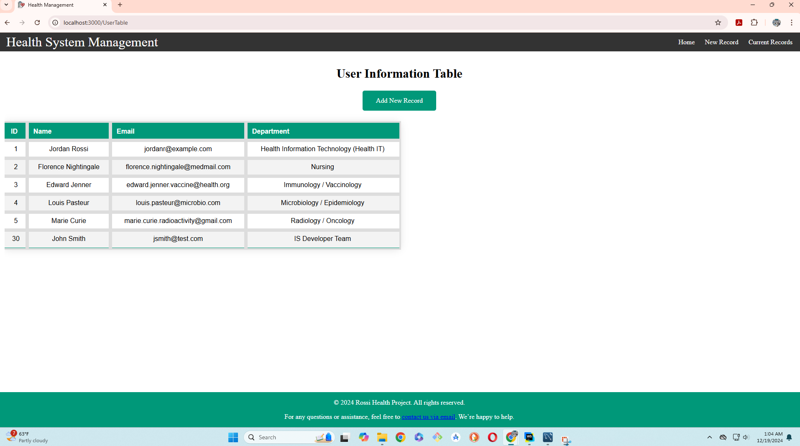

# Health Project
12/17/24

Summary of Progress

- Set up the backend of the project using Express and connected it to a MySQL database (health_db).

- Created the MySQL database and added a users table with 5 sample users, including fields for ID, name, email, and department.

- Created basic CRUD API routes to interact with the users table in the MySQL database.

- Secured sensitive information, such as database credentials, by using a .env file and loading it with the help of dotenv.

- Configured the project to ignore sensitive and unnecessary files using a .gitignore file (including .env, .idea, and node_modules).

- Successfully tested the backend by running it on a different port (5000) and fetching data from the MySQL database.
# Screenshot of the MySQL database:

12/18/24

Summary of Progress

- Initialized the project frontend using React and successfully connected it to the backend via Axios for data fetching.

- Updated the UserTable component to display user information in a structured table format & updated styling.

- Successfully tested the frontend by running it on a separate port (3000) and verifying data fetching from the MySQL database.

# Screenshot of the frontend interface:

12/19/24

Summary of Progress
- Added route paths for pages to allow users to navigate seamlessly across the application.
- Nav component was created to provide a consistent navigation bar across the application. Styling was applied to the navigation bar to enhance the user interface.
- The Link component from React Router is used to link pages together and allow users to navigate without full-page reloads.
- Links are set up to navigate between the various routes defined in the app.
- A form page was created where users can input data to add new records to the database.
- The form is connected to the backend through a POST request to send the data to the server.
- The server (server.js) is configured to handle the POST request that adds new data to the MySQL database.

# Screenshot of the form page:

# After screenshot of the UserTable page with React rendering data from the SQL database

12/18/24

Summary of Progress

- Added an update table with input fields in UserTable.jsx to modify user info in React.
- Integrated Axios to send updated user data to the backend.
- Created a PUT endpoint in Express (/api/users/:id) to handle user data updates.
- Updated MySQL database with the modified user information from the React frontend.
- Improved .gitignore to exclude unnecessary files and ensure proper commit handling.

# Screenshot of the update table:

-
-

# After screenshot of the update table with React rendering data from the SQL database
